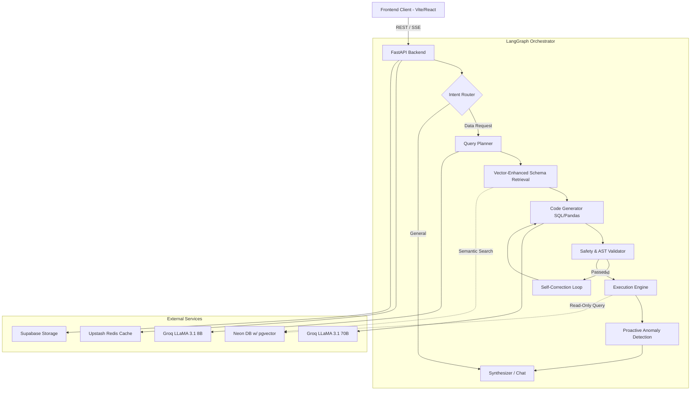

      ___           ___           ___           ___           ___     
     /  /\         /  /\         /  /\         /  /\         /  /\    
    /  /::\       /  /::\       /  /::\       /  /::\       /  /::\   
   /  /:/\:\     /  /:/\:\     /  /:/\:\     /  /:/\:\     /  /:/\:\  
  /  /:/~/:/    /  /:/  \:\   /  /:/  \:\   /  /:/  \:\   /  /:/~/:/  
 /__/:/ /:/___ /__/:/ \__\:\ /__/:/ \__\:\ /__/:/ \__\:\ /__/:/ /:/___
 \  \:\/:::::/ \  \:\ /  /:/ \  \:\ /  /:/ \  \:\ /  /:/ \  \:\/:::::/
  \  \::/~~~~   \  \:\  /:/   \  \:\  /:/   \  \:\  /:/   \  \::/~~~~ 
   \  \:\        \  \:\/:/     \  \:\/:/     \  \:\/:/     \  \:\     
    \  \:\        \  \::/       \  \::/       \  \::/       \  \:\    
     \__\/         \__\/         \__\/         \__\/         \__\/    

           A U T O N O M O U S   D A T A   A N A L Y S T

# Technical Architecture and System Design

This project implements a high-performance, self-correcting autonomous agent for complex data analysis. It leverages an orchestrated multi-agent workflow to transform natural language queries into executable code (SQL or Pandas), validate the output for security and correctness, and synthesize multi-dimensional insights with proactive anomaly detection.

## System Architecture



### Core Components

#### 1. Language Model Orchestration
The system utilizes a dual-model approach via Groq for low-latency inference:
- **Planner/Router**: Llama-3.1-8b handles intent classification and high-level query planning.
- **Generator/Synthesizer**: Llama-3.1-70b handles complex code generation and multi-variable insight synthesis.

#### 2. Vector-Enhanced Schema Retrieval
To handle large-scale database schemas without overflowing the LLM context window, the system implements a RAG (Retrieval-Augmented Generation) pattern for metadata:
- **Local Embeddings**: Uses `sentence-transformers/all-mpnet-base-v2` locally to generate 768-dimensional vectors.
- **pgvector Integration**: Stores table/column summaries in a Neon Postgres database.
- **Semantic Mapping**: Queries are embedded and compared against the schema vector space to retrieve only the most relevant tables and relationships for the specific request.

#### 3. State-Machine Driven Workflow (LangGraph)
The agent pipeline is structured into distinct nodes:
- **Intent Router**: Determines if the query requires SQL, Pandas analysis, or a general system response.
- **Memory Retriever**: Injects context from previous turns using cosine similarity over the conversation history.
- **Query Planner**: Formulates an execution strategy, identifying necessary joins, aggregations, and filtering logic.
- **Generator**: Produces the primary execution code (Postgres-dialect SQL or Python-Pandas).
- **Safety Validator**: Performs abstract syntax tree (AST) analysis via `sqlglot` and `RestrictedPython` to block unauthorized commands (DML/DDL) and unsafe system calls.
- **Self-Correction Loop**: If execution fails, an error classifier captures the traceback and feeds it back into the generator for up to three repair attempts.

## Technical Optimizations

### High-Performance Infrastructure
- **Threaded Connection Pooling**: A singleton-based `ThreadedConnectionPool` manages database connections to Neon, eliminating the overhead of repeated TLS handshakes.
- **Pre-baked Embedding Cache**: The embedding model is baked into the production Docker image, ensuring instant cold starts and zero runtime download latency.
- **In-Memory Caching**: Implements LRU (Least Recently Used) caching for both schema context and embedding computations to accelerate repeated query patterns.

### Observability and Metrics
The system provides deep observability via a real-time tracing engine:
- **Node-Level Tracing**: Captures start/end timestamps, token usage, and status for every node in the graph.
- **SSE Streaming**: Broadcasts trace events to the frontend via Server-Sent Events, enabling live pipeline visualization.
- **System Metrics**: Tracks p50/p95/p99 latencies, cache hit ratios, and autonomous correction rates to monitor system health and LLM efficiency.

## Security Architecture

Security is enforced at multiple layers to allow safe execution of LLM-generated code:
- **SQL Sanitization**: Uses `sqlglot` to parse generated SQL into an AST, ensuring only `SELECT` operations are performed.
- **Python Sandboxing**: Executes Pandas code in a restricted environment using `RestrictedPython`, blocking access to the filesystem, network, and sensitive built-ins.
- **Read-Only Database Sessions**: Database connections are forced into `SET SESSION CHARACTERISTICS AS TRANSACTION READ ONLY` mode at the driver level as a final failsafe.

## Proactive Data Intelligence

Beyond reactive query answering, the system implements proactive nodes:
- **Anomaly Detection Engine**: Runs parallel statistical tests (Z-score for outliers, trend analysis for spikes, and null-concentration checks) on every result set to surface insights the user may not have explicitly requested.
- **Data Profiling Node**: Performs comprehensive statistical analysis of new datasets, including cardinality checks, type inference, and cross-column correlation matrices.

## Deployment Stack

The architecture is optimized for a containerized, cloud-agnostic deployment:
- **Backend**: FastAPI / Python 3.11
- **Orchestration**: LangGraph
- **Database**: Neon (Postgres + pgvector)
- **Caching**: Upstash (Redis)
- **Hosting**: Railway (via Docker)
- **CI/CD**: GitHub Actions for automated testing and deployment triggers.

## Setup & Testing with Real Data

Follow these instructions to run the project locally.

1. **Install Dependencies**
   ```bash
   pip install -r requirements.txt
   ```

2. **Configure Environment Variables**
   Copy `.env.example` to `.env` and fill in the requisite API keys (Groq, Neon DB, Upstash, Supabase).
   ```bash
   cp .env.example .env
   ```

3. **Database Migrations**
   Run the migration script to establish pgvector support and create necessary tables for history and embeddings.
   ```bash
   psql $NEON_DATABASE_URL -f scripts/migrate.sql
   ```

4. **Seed the Database (Demo E-Commerce Data)**
   Run the demo seed script which generates comprehensive e-commerce tables (products, customers, orders).
   ```bash
   python scripts/seed_demo.py
   ```

5. **Start API Server**
   ```bash
   uvicorn api.main:app --reload
   ```

6. **Start Frontend Client**
   In a separate terminal:
   ```bash
   cd frontend
   npm install
   npm run dev
   ```
