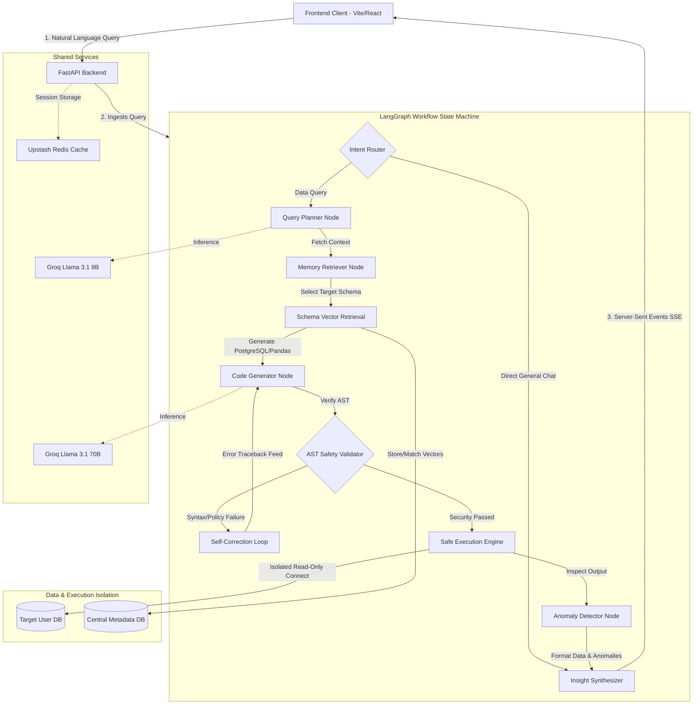

# 🤖 Autonomous Multi-Agent Data Analytics System

An advanced, self-correcting multi-agent AI system that transforms natural language queries into secure database operations, profiles data schemas, detects outliers dynamically, and compiles insights into professional analytical reports.

---

## 🛠️ System Architecture

The following diagram illustrates the complete end-to-end request-response life cycle, showcasing the **LangGraph Orchestrator**, secure **AST Sandboxing**, and dynamic **Multi-Tenant Database Ingestion**:



---

## 🔒 Security Architecture (Recruiter & Enterprise Review)

Allowing AI models to write and execute code on live relational databases presents extreme security risks. This platform solves this by enforcing **four layers of strict containment**:

1. **Client-Side Credential Tokenization (Symmetric Key Cipher):**
   When a user inputs their custom cloud PostgreSQL connection URI, the backend immediately encrypts it using a server-side symmetric block key derived dynamically using SHA-256 and an XOR stream cipher. The frontend only stores the secure token (`postgres-enc:XYZ...`) in its session state—meaning **raw passwords never touch server logs, browser caches, or persistent disk storage.**
2. **Abstract Syntax Tree (AST) Parsing:**
   Before any query is sent to a target database, it is compiled into an AST using `sqlglot`. If the parser detects any blocked operations (e.g., `DROP`, `DELETE`, `ALTER`, `UPDATE`, `INSERT`), the query is terminated instantly.
3. **Restricted Python Sandboxing:**
   For tabular files (CSVs), code is executed under `RestrictedPython`, blocking access to the local filesystem, shell, importing malicious packages, and private built-ins.
4. **Session-Level Read-Only Isolation:**
   All database sessions are forced into strict read-only transactions at the database driver level:
   ```python
   conn.set_session(readonly=True, autocommit=True)
   ```
   Custom user database queries completely bypass the platform's global connection pool, ensuring zero session leakage or database cross-talk.

---

## 📖 User Perspective & Operating Guide

From an analyst's or business user's perspective, the system operates as a seamless companion dashboard:

### 1. Ingesting Your Data Sources
Click **Upload Data** in the left sidebar. The system supports two methods of analysis:
* **Option A (Local Files):** Drag and drop a `.csv`, `.sqlite`, or `.db` file. The backend loads it dynamically into a sandbox-safe, fast in-memory database workspace.
* **Option B (Secure Cloud Database):** Paste a standard public PostgreSQL connection string (from Railway, AWS RDS, GCP Cloud SQL, Azure, etc.) and type your target schema name (e.g. `public`). 
  * The system will automatically establish an isolated connection, profile your schema, embed your table descriptions, and index them into semantic search memory.

### 2. Conversational Analytical Chat
Navigate to the **Chat** screen:
* Choose your active database source using the selector at the top.
* Ask natural language questions like: *"Show me our monthly order volume for the past year and point out any spikes."* or *"What are the top 5 highest-grossing products?"*
* The agent dynamically translates the request, generates clean Postgres-dialect SQL, executes it, creates interactive chart specifications using Plotly, and provides statistical insights.

### 3. Automated Anomaly Detection
Every query result is piped through our parallel statistical anomaly engine. If the system detects spikes, outlier points, or extreme values in your dataset, it highlights them automatically under the **Anomalies Found** banner.

### 4. Interactive Metrics Dashboard
Click **Dashboard** in the sidebar to review your saved charts, add custom titles, and compile real-time metric cards. You can trace query execution status (e.g., Latency, LLM token count, Self-correction rates) directly in the **Metrics** panel.

### 5. Professional Report Export
When your analysis is complete, click **Export PDF** at the top right of the Chat screen. The system compiles your session history, charts, and mathematical insights into a polished, print-ready executive PDF report.

---

## 🚀 Quickstart Guide (Local Development)

### Prerequisites
* **Python 3.11+** installed
* **Node.js 18+** installed

### 1. Configure the Environment
Clone the repository, copy the example environment file, and populate your API credentials:
```bash
cp .env.example .env
```
*Specify your `GROQ_API_KEY`, your active `NEON_DATABASE_URL` (metadata store), and other optional parameters.*

### 2. Initialize the Metadata Database
The platform requires a PostgreSQL database with `pgvector` enabled to act as its primary system store. Run the migrations script against your database to set up system tables:
```bash
# Run migration setup script
python scripts/run_migration.py
```

### 3. Seed Demo Data (Optional)
To test the system immediately with realistic e-commerce datasets (customers, orders, products):
```bash
python scripts/seed_demo.py
```

### 4. Boot the FastAPI Backend
```bash
pip install -r requirements.txt
python -m uvicorn api.main:app --host 127.0.0.1 --port 8000
```

### 5. Boot the Vite/React Frontend
In a separate terminal:
```bash
cd frontend
npm install
npm run dev
```

Open your browser to **`http://localhost:5173/`** to begin your analytical session!

---

## Deployed Production Usage (Recruiter & Public Demo Guide)

Once this project is deployed to a cloud platform (e.g. Railway, Render, AWS, GCP), users and technical recruiters can utilize the live system instantly without downloading any code or setting up local files.

### 🌟 Instant Recruiter Testing (Zero Setup Required)
If you are evaluating this project as a hiring manager or recruiter:
1. Open the live production URL of the deployed application (e.g. `https://your-data-analyst-agent.up.railway.app`).
2. **Immediate Demo Database Access:** On the **Chat** page, look at the database selector in the top-left corner. It will be pre-configured with **`Demo DB (Neon)`**.
3. **Ask Queries Instantly:** You can start chatting with the agent immediately using the pre-seeded e-commerce data (e.g. *"Show me total revenue per product category as a bar chart"* or *"Highlight any anomalies in monthly customer signups"*).
4. **Connect Your Own Cloud Database:** Go to the **Upload Data** tab, click **Connect Cloud Database**, paste any standard PostgreSQL URL from Railway/AWS/GCP, and hit **Securely Link & Query Database** to immediately analyze your own datasets.

---

## ☁️ How to Deploy to Production (Self-Hosting Guide)

This repository is optimized for one-click containerized or buildpack-based cloud deployments (such as **Railway** or **Render**).

### 1. Set Up the Metadata Database
1. Provision a new PostgreSQL instance on your cloud provider (e.g., Railway PostgreSQL, which includes the `pgvector` extension by default).
2. Copy the public connection string of the new database.
3. Run the migrations locally against this remote database to set up all system tables:
   ```bash
   # Run against your remote production URL
   NEON_DATABASE_URL="your-production-db-url" python scripts/run_migration.py
   ```

### 2. Configure Production Environment Variables
Set the following environment variables in your cloud provider's deployment settings dashboard:

```env
# Core LLM & Database
GROQ_API_KEY=your_production_groq_key
NEON_DATABASE_URL=your_production_postgres_url

# Cache & Storage (Optional, for high-scale caching)
UPSTASH_REDIS_REST_URL=your_redis_url
UPSTASH_REDIS_REST_TOKEN=your_redis_token

# Application Config
DEMO_MODE=false
VITE_API_BASE_URL=https://your-backend-api-url.com
```

### 3. Deploy Backend & Frontend
* **Railway Deployment:** 
  Railway will automatically detect the `Procfile` in the root folder and the Dockerfile settings, booting the FastAPI backend and compiling the static React production assets dynamically.
* **Docker Deployment:**
  You can build and run the multi-stage Docker configurations in any cloud environment:
  ```bash
  docker build -t data-analyst-agent .
  docker run -p 8000:8000 --env-file .env data-analyst-agent
  ```

